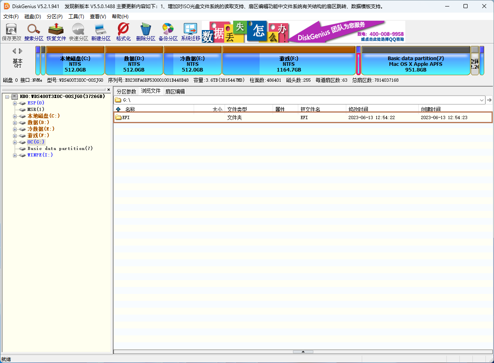
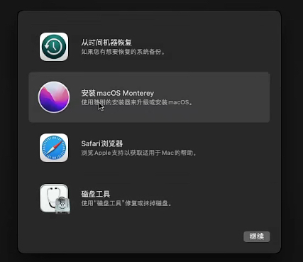

# 联想拯救者 R7000P （2020款） 黑苹果全新安装指南

> ⚠️ **阅前注意**
>
> - 引导文件仅在 R7000P（2020款）上测试，其他类似型号请自行测试可用性。
> - 引导文件仅适配 macOS Sonoma，版本号最高适配到14.4.*

## 准备工作

1. U盘*1，制作为**macOS系统安装盘**。
   请参考 https://sumingyd.github.io/OpenCore-Install-Guide/installer-guide/windows-install.html

   > ⚠️ 系统镜像版本请选择macOS Sonoma

2. U盘*1，制作为**UMAF启动盘**，用于后续步骤修改显存用。简要方法如下：

   1. 将该U盘格式化为FAT32格式。
   2. 下载并解压[UniversalAMDFormBrowser.zip](https://github.com/DavidS95/Smokeless_UMAF/blob/main/UniversalAMDFormBrowser.zip)里的所有文件，复制到该U盘的根目录下。

3. 在你要安装macOS的硬盘上，划分所需分区

   > 推荐使用[DiskGenius](https://www.diskgenius.cn/)，图例参考[wushuo894的指南](https://github.com/wushuo894/Lenovo-R7000P-2020-Hackintosh)。

   1. 不推荐安装到原装的海力士/三星SSD上（存在未知兼容问题），建议另行加装一块黑苹果友好的SSD。
      以供参考，个人使用的是西数SN550。
   2. 划分OpenCore引导文件使用的EFI分区：大小建议500MB，格式化为FAT32。
   3. 划分macOS的系统分区：大小根据你的需要，格式暂时选NTFS（占位用，后续安装系统时会重新格式化为苹果的文件系统格式）。

4. 一个趁手的OpenCore引导文件配置编辑工具

   - 新手推荐使用[OpenCore Auxiliary Tools (OCAT)](https://github.com/ic005k/OCAuxiliaryTools)，下文以OCAT为例。
   - 你也可以使用[ProperTree](https://www.bing.com/search?q=propertree&PC=U316&FORM=CHROMN)。

5. 使用网线联网。

6. 连接有线键鼠/2.4G无线键鼠，不要使用蓝牙键鼠。因为在安装界面操作时，内置键盘/触控版有概率突然失效。

7. 显卡切换到混合模式。

8. BIOS关闭安全启动。

   1. 重启按 F2 进入BIOS
   2. Security > Secure Boot

   

9. 【非必须，推荐】升级BIOS版本到[FSCN28WW](https://newsupport.lenovo.com.cn/driveDownloads_detail.html?driveId=123039)，能解决黑苹果的一些奇怪的睡眠问题。

   - ⚠️ 升级BIOS前，请务必使用HDMI连接一个外接显示器。
   - BIOS升级完成重启后，笔记本内置屏幕会黑屏。此时先依靠外接显示器进入BIOS，切换显卡模式为混合模式，保存后重启。
   - 如果没有模式切换选项，重启重新进入一次BIOS。

   

## Step1 准备OC引导配置

1. 从[本仓库Release](https://github.com/jimlee2048/Hackintosh-Lenovo-Legion-R7000P2020H/releases/)下载我预配置好的OpenCore引导文件，解压。

2. 编辑OpenCore引导配置（`EFI/OC/config.plist`）：

   1. 在 Kernel > Add 下禁用核显驱动`NootedRed.kext`，完成后保存。

   > ⚠️ 每次安装/升级系统前都需要禁用`NootedRed.kext`，否则无法正常引导。

   

   2. 转到 PI > Generic，确认`SystemProductName`为`MacBookPro 16,3`，点击旁边的`生成`，生成一套SN、MLB、UUID
   3. 复制生成所得的SN码，参考[国光的黑苹果指南](https://github.com/sqlsec/Hackintosh/blob/main/docs/4-OC%E9%85%8D%E7%BD%AE/4-7.md#%E4%BD%A0%E7%9A%84%E5%BA%8F%E5%88%97%E5%8F%B7%E6%98%AF%E5%90%A6%E5%AE%8C%E7%BE%8E)检查SN码状态。
      1. 如果**无效序列号**or**有效没有被用过的序列号**：保存即可。
      2. 如果**有效但被用过的序列号**：重新生成一套，直至情况1。
   4. 【可选，非必须】填写ROM码：点击`生成`或[填写有线网卡的MAC地址](https://sumingyd.github.io/OpenCore-Post-Install/universal/iservices.html#%E8%8E%B7%E5%BE%97%E7%9B%B8%E5%BA%94%E7%9A%84rom%E5%80%BC)。

   

3. 将修改好的整个EFI文件夹复制到准备工作中划分的EFI分区中。你可以在DiskGenius中直接拖放。

   


## Step2 安装macOS

1. 插入准备好的**macOS系统安装盘**。

2. 重启到BIOS，设置OpenCore启动项优先，保存后再次重启。

3. 进入OpenCore引导界面，回车选择**macOS系统安装盘**。

4. 进入macOS系统安装界面，点击 **磁盘工具** 抹掉准备工作中预先划分给 macOS 的系统分区 ，格式选择 **APFS**。

   > ⚠️ 注意：
   >
   > - 进行抹掉操作前请再次确认目标分区。
   > - 不推荐选择大小写敏感的文件系统，部分App会不兼容。

5. 回到主页面，点击开始安装，分区选择**刚刚抹掉的分区**。
   安装过程中会有多次重启，安装完成后继续走初始化配置流程（新建用户等），确保最后能成功到进入桌面。

   

6. 编辑OpenCore引导配置（`EFI/OC/config.plist`），在 Kernel > Add 下重新启用核显驱动`NootedRed.kext`。你可以：

   - 在macOS下，下载安装[OCAuxiliaryTools (OCAT)](https://github.com/ic005k/OCAuxiliaryTools)，直接挂载OC的EFI分区并修改，完成后保存重启。

   - 重启回到Windows或PE，在Win环境下使用[OCAuxiliaryTools (OCAT)](https://github.com/ic005k/OCAuxiliaryTools)修改，完成后覆盖到OC的EFI分区中。

   - 无论是哪种方式，修改完成重启到OpenCore引导时，建议触发一次 `Reset NVRAM`，以避免奇怪的问题。对于多系统用户，`Reset NVRAM`后很可能需要重新在BIOS内设置引导项顺序。

     

7. 系统安装完成！现在你可以初步试用一下，留意存在的问题。

## Step3 安装后的配置

1. 使用UMAF修改核显显存为2G，能有效避免部分应用启动卡顿的问题。

   1. 插入准备好的**UMAF启动盘**，重启引导进入UMAF（可以在OpenCore引导界面选择）
   2. Device Manager > AMD CBS > NBIO Common Options > GFX Configuration > UMA Frame Buffer Size，设为 2G
   3. 保存并退出，重启到macOS检查是否修改成功。

   > ⚠️ 注意：后续如果在BIOS进行更改（如修改启动项），会使先前在UMAF设置的显存大小失效，此时需要重新进UMAF改一遍。

2. 关闭有问题的深度睡眠。打开终端，输入以下指令：

   ```shell
   sudo pmset -a hibernatemode 0
   sudo pmset -a autopoweroff 0
   sudo pmset -a standby 0
   ```

3. 如果你想禁止在macOS上自动挂载**安装在第1个NVME硬盘位**上的原装SSD：你可以编辑 OC 引导配置，在 ACPI > Add 下启用`SSDT-NVME0-DISABLE.aml`。保存后重启生效。

4. 遇到其他问题？请先看看`README.md`内[已知问题](../README.md#%E5%B7%B2%E7%9F%A5%E9%97%AE%E9%A2%98)部分的介绍。如果仍无法解决，在本仓库维护期内，欢迎留 issue。

   > ⚠️ 注意：仅积极解答R7000P（2020款）& macOS Sonoma 环境的 issue，其他型号/系统版本只能随缘提供帮助。


## 参考资料

- [W2725730722/Lenovo-R7000P-2020-Hackintosh: 联想拯救者 R7000P 2020 黑苹果 (github.com)](https://github.com/W2725730722/Lenovo-R7000P-2020-Hackintosh)
- [OpenCore安装指南 (sumingyd.github.io)](https://sumingyd.github.io/OpenCore-Install-Guide/)
- [sqlsec/Hackintosh: 国光的黑苹果安装教程：手把手教你配置 OpenCore (github.com)](https://github.com/sqlsec/Hackintosh)

